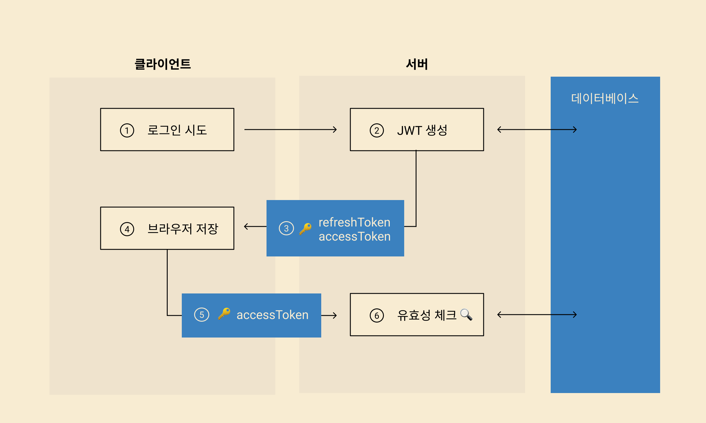

# JWT 란?
JWT(Json Web Token)는 웹에서 사용되는 JSON 형식의 토큰에 대한 표준 규격.   

주로 사용자의 인증(authentication) 또는 인가(authorization) 정보를 서버와 클라이언트 간에 안전하게 주고 받기 위해서 사용.

JWT 토큰 웹에서 보통 ```Authorization``` HTTP 헤더를 ```Bearer <토큰>```의 형태로 설정하여 클라이언트에서 서버로 전송되며, 서버에서는 토큰에 포함되어 있는 서명(signature) 정보를 통해서 위변조 여부를 빠르게 검증할 수 있게 됩니다.

JWT 토큰은 Base64로 인코딩이 되어 있어서 육안으로 보면 **eyJ**로 시작하는 아주 긴 문자열. 온라인 디버거를 통해서 어렵지 않게 실제로 저장되어 있는 내용을 JSON 형태로 디코딩하여 확인해볼 수 있습니다.
## JWT를 이용하여 로그인 하는법 

1. 유저가 로그인할 때    
2. 서버가 인증 정보를 보내주는데, 암호화나 시그니처 추가가 가능한 데이터 패키지안에 인증 정보를 담아 보내준다. (이 패키지가 JSON Web Token 즉 JWT다.)   
3. 담기는 정보 중 accessToken과 refreshToken이 이후 유저 인증에 사용되는데   
4. 이 정보를 클라이언트에 저장해둔다.
5. 이 accessToken을 유저에게만 보여줄 수 있는 정보에 접근할 때 서버에 보내면  
6. 서버는 그 토큰이 유효한지 확인하는 방식으로 인증한다.


좀 더 자세히 설명하면 실질적인 인증 정보는 accessToken인데 일정 시간이 지나면 만료하는 구조를 가지고있다. (로그인 후 며칠 뒤 로그인이 만료돼서 다시 로그인해야 했던 경험이 있는가?) refreshToken을 이용해 로그인을 지속적으로 유지할 수도 있다. refreshToken을 서버에 보내면 그때마다 새로운 accessToken을 발급해 돌려주는 거다. refreshToken 사용은 옵션이다.


## JWT 구조
하나의 JWT 토큰은 헤더(header)와 페이로드(payload), 서명(signature) 이렇게 세 부분으로 이루어지며 각 구역이 . 기호로 구분

```
<header>.<payload>.<signature>
```
첫 번째 부분인 헤더(header)에는 토큰의 유형과 서명 알고리즘에 명시되고, 
중간 부분인 페이로드(payload)에는 소위 claim이라고도 불리는 사용자의 인증/인가 정보가 담긴다. 
마지막 부분인 서명(signature)에는 헤더와 페이로드가 비밀키로 서명되어 저장됨.

JWT 토큰은 네트워크로 전송되야 하기 때문에 공간을 적게 차지하는 것이 유리하다. 그래서 독특하게도 JSON 형식으로 데이터를 저장할 때 키(key)를 3글자로 줄이는 관행이 있습니다.  

JWT에서 자주 사용되는 JSON 키 이름은 다음과 같습니다.

- sub 키: 인증 주체(subject)
- iss 키: 토큰 발급처
- typ 키: 토큰의 유형(type)
- alg 키: 서명 알고리즘(algorithm)
- iat 키: 발급 시각(issued at)
- exp 키: 말료 시작(expiration time)
- aud 키: 클라이언트(audience)

## JWT를 통한 인증/인가
JWT는 실무에서 OAuth나 OIDC 프로토콜과 함께 API의 인증이나 인가를 위해서 주로 사용.

보통 클라이언트가 어떤 서비스의 인가 서버를 통해 로그인에 성공하면 JWT 토큰을 획득할 수 있는데요. 그러면 클라이언트는 해당 서비스의 API를 호출할 때 JWT 토큰을 보내서 원하는 자원에 접근하거나 허용된 작업을 수행할 수 있게됩니다.

## JWT의 장점
JWT가 등장하기 전에는 웹에서 쿠키(cookie)와 세션(session)을 이용한 사용자 인증을 구현하는 경우가 다수. 

가장 큰 이유는 확장성  
JWT는 토큰 자체에 사용자의 정보가 저장되어 있어있기 때문에, 서버 입장에서 토큰을 검증만 해주면 됩니다.

반면에 쿠키와 세션을 사용할 때는 서버 단에 로그인한 모든 사용자의 세션을 DB나 캐시(cache)에 저장해놓고 쿠키로 넘어온 세션 ID로 사용자 데이터를 매번 조회해야만 한다.

따라서 JWT를 사용할 때는 사용자가 늘어나더라도 사용자 인증을 위해서 추가로 투자해야하는 인프라 비용을 크게 절감.

뿐만 아니라 쿠키를 사용하지 않으므로 CORS 문제에서 자유로워진다는 것도 장점으로 여겨질 수 있겠습니다.

## JWT의 한계
위와 같은 JWT의 장점에도 불구하고 어느 정도 규모가 있는 서비스에서 사용자 인증 용도로 JWT를 사용하기에는 부족한 경우가 있는데요.

예를 들어, 현재 로그인된 사용자의 모든 장비들을 나열해주거나, 특정 장비에서 로그아웃을 허용하는 기능을 구현하려면 서버 단에 사용자 세션을 저장하지 않고는 어렵기 때문.

## JWT 사용 시 주의 사항
서명이 되어 있는 JWT 토큰 서버에서만 유효성을 검증할 수 있지만 그 안에 저장된 데이터는 누구나 쉽게 열람이 가능합니다. 따라서 민감한 사용자 정보를 JWT 토큰에 그대로 저장하게 되면 큰 보안 문제로 이어질 수 있어서 각별한 주의가 필요하겠습니다.

가급적 JWT 토큰에는 사용자를 식별할 수 있는 아이디 정도만 저장하는 것이 좋으며 해당 사용자에 대한 추가 정보가 필요한 경우에는 서버에서 사용자 DB를 조회하는 것이 안전할 것입니다. 불가피한 이유로 JWT 토큰에 민감한 사용자 정보를 저장해야한다면 반드시 암호화를 하여 JWT 토큰을 디코딩한 후에도 알아볼 수 없게 해야할 것입니다.

## Reference
https://www.daleseo.com/jwt/
https://velog.io/@thelm3716/JWTvul
https://velog.io/@yaytomato/%ED%94%84%EB%A1%A0%ED%8A%B8%EC%97%90%EC%84%9C-%EC%95%88%EC%A0%84%ED%95%98%EA%B2%8C-%EB%A1%9C%EA%B7%B8%EC%9D%B8-%EC%B2%98%EB%A6%AC%ED%95%98%EA%B8%B0