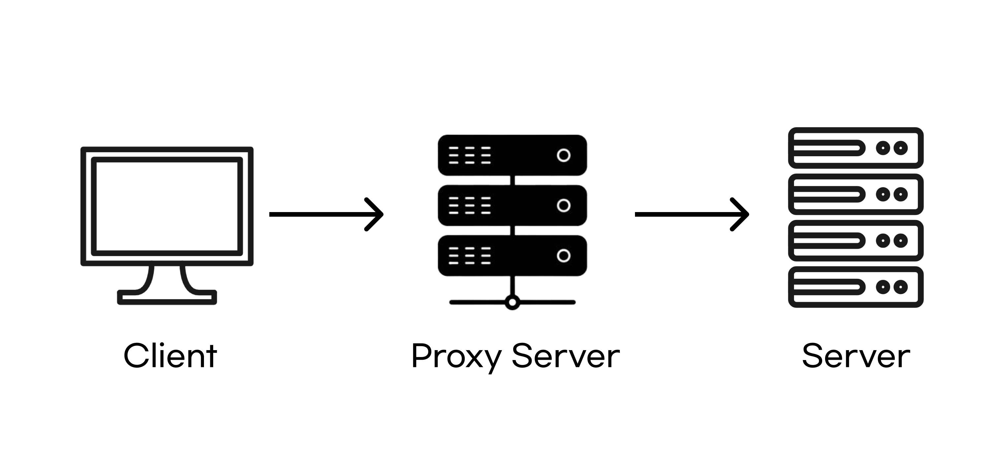
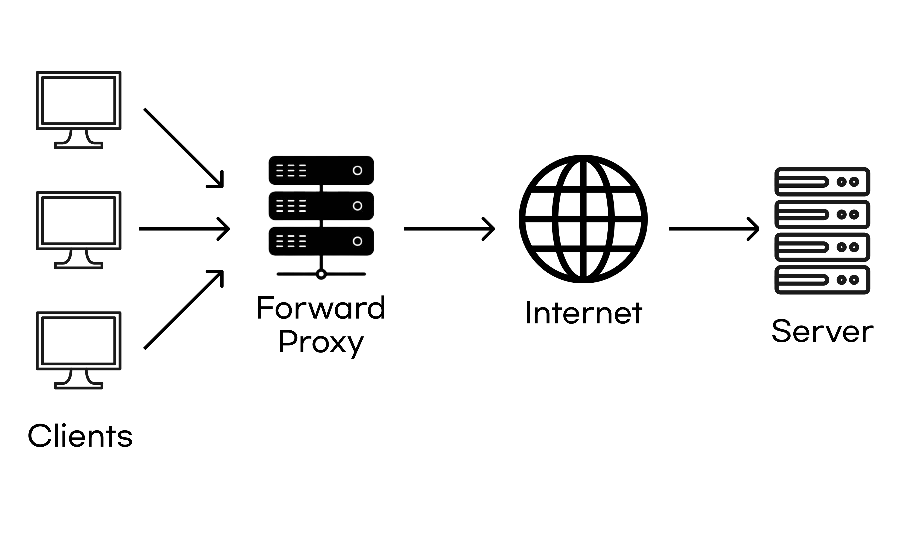
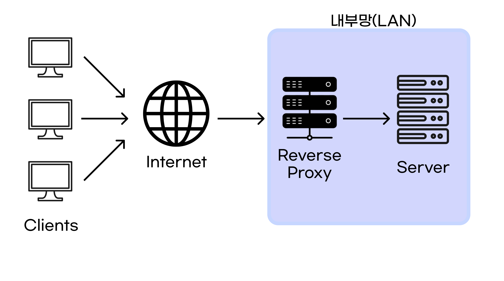

# 프록시(Proxy)란?

프록시(Proxy)는 "대리"의 의미로, 인터넷과 관련해서 쓰이는 경우,**특히 내부 네트워크에서 인터넷 접속을 할 때에, 빠른 액세스나 안전한 통신등을 확보하기 위한 중계서버를 "프록시 서버"라고 일컫는다.**  
클라이언트와 Web서버의 중간에 위치하고 있어, 대신 통신을 받아 주는 것이 프록시 서버이다.

## 프록시(Proxy)의 종류

프록시(Proxy)는 포워드 프록시와 리버스 프록시로 나뉘어져, 기본적으로 포워드 프록시는 클라이언트쪽, 리버스 프록시는 서버쪽의 설정을 한다.

### 포워드 프록시
포워드 프록시 서버는 클라이언트 바로 뒤에 놓여 있다. 클라이언트가 요청을 할 경우 요청을 하는 서버로 바로 가는 것이 아니라 요청 서버의 주소를 포워드 프록시에 전달을 하게 된다.이 후에 포워드 프록시가 요청 서버로 부터 리소스를 응답받아 클라이언트에게 전달을 해준다.

### 포워드 프록시의 장점
- 보안 : 클라이언트는 포워드 프록시를 통해서만 외부에 요청을 하기 때문에 클라이언트가 해당 서버 혹은 웹 사이트에 직접적으로 접근하는 것을 방지할 수 있다. 대표적인 예가 클라이언트가 특정 사이트에 접근할 수 없도록 막을 수 있는 기능이다.

- 캐시 저장(액세스 고속화):프록시 서버에 캐시를 저장할 수 있다. 다시 동일한 페이지를 리퀘스트 했을 때에는 캐시에 남아 있는 정보를 클라이언트에게 준다. 이것으로 사이트에 접속하는 속도가 빨라진다.또한 클라이언트는 캐싱된 데이터를 받아오기 때문에 서버에 부하를 줄일 수 있다

### 리버스 프록시

**포워드 프록시와 달리 Web 서버쪽에 위치하여 클라이언트의 접근을 최초로 받아 리퀘스트에 해당하는 Web 서버에 배분해주는 역할을 한다.**

web서버가 여러개일 경우,클라이언트에서 액세스를 프록시 서버에 집약해서 URL에 따라 리퀘스트를 받을 Web 서버가 바뀌도록 설정하고 있다.

이 때 클라이언트의 입장에 있어서는 프록시 서버가 Web 서버와 같은 동작을 하므로 Web서버가 여러 개 존재하는 것을 은폐할 수 있는 것도 리버스 프록시의 특징이다.

### 리버스 프록시의 장점

- 부담 분산: 설정으로 정적 콘텐츠와 동적 콘텐츠의 보는 곳을 나눔으로써 메모리 사용량의 효율화를 할 수 있다. 로드 밸런스와 병용하면 더욱 부담을 분산할 수 있다.

- 로드 밸런싱 : 서버의 트래픽이 몰리게 되면 하나의 서버로는 해당 요청을 감당하기 힘들어 지는 경우가 발생한다. 이럴 때 여러 대의 서버를 두고 요청을 분산시키는 것이 로드 밸런싱이다. 리버스 프록시는 여러 대의 서버에 분산시켜 요청을 보내게 된다. 이렇게 하면 서버의 부하를 분산시킬 수 있다.

- 캐시의 저장:포워트 프록시와 동일하게 동일한 데이터를 얻을 때에 프록시 서버가 저장했던 내용을 돌려준다.

- 보안 : 리버스 프록시는 웹 서버 앞에 놓이기 때문에 웹 서버에 직접 접근하는 것이 아닌 리버스 프록시를 통해 접근하게 된다. 이렇게 되면 웹 서버의 IP를 노출시키지 않을 수 있기 때문에 웹 서버에 대한 1차적인 공격을 막을 수 있다. (Proxy 서버의 IP만 노출)

## 프록시vsVPN의차이

### 클라이언트 서버 통신에서 하는 역할
- 프록시:프록시 서버는 클라이언트와 서버 간의 통신을 익명화합니다.
- VPN:VPN은 클라이언트와 서버 간의 통신을 익명화하고 암호화합니다.

### 들어오는 트래픽

- 프록시:역방향 프록시 서버는 들어오는 트래픽을 심사하고 분산합니다. 프록시 서버에 도달하는 트래픽은 제어할 수 없습니다.

- VPN:VPN은 원격 디바이스에 설치된 VPN 클라이언트 소프트웨어와 기업 네트워크 간의 트래픽을 암호화합니다. 네트워크에 액세스할 수 있는 사람을 제어할 수 있습니다.

### 나가는 트래픽

- 프록시:정방향 프록시 서버는 나가는 트래픽을 익명화합니다.

- VPN:VPN은 나가는 트래픽을 익명화하고 암호화합니다.

### 사용 사례 예시

- 프록시:역방향 프록시 서버는 로드 밸런싱과 트래픽 분산을 지원합니다.

- VPN:클라이언트 VPN을 사용하면 원격 사용자가 조직의 네트워크에 안전하게 연결할 수 있습니다.

## Reference
https://aws.amazon.com/ko/compare/the-difference-between-proxy-and-vpn/
https://velog.io/@dev_leewoooo/Forward-Proxy-Reverse-Proxy%EC%97%90-%EA%B4%80%ED%95%98%EC%97%AC
https://jmdwlee.tistory.com/40