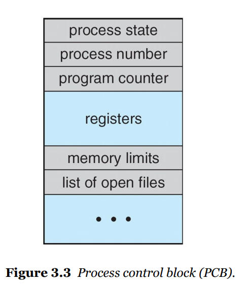

# 3.1.3 프로세스 제어 블록(rocese Comorpos)

각 프로세스는 운영체제에서 프로세스 제어 블록(PCB, Process Control Block)(태스크 제어 블록 이라고도 불린다)에 의해 표현된다. 그림 3.3은 PCB를 나타낸다. 프로세스 제어 블록은 특정 프로세스와 연관된 여러 정보를 수록하며, 다음과 같은 것들을 포함한다.

- **프로세스 상태**: 상태는 새로운(new), 준비완료(ready), 실행(running), 대기(waiting)
  또는 정지(halted) 상태 등이다.
- **프로그램 카운터**: 프로그램 카운터는 이 프로세스가 다음에 실행할 명령어의 주소를
  가리킨다.
- **CPU 레지스터들**: CPU 레지스터는 컴퓨터의 구조에 따라 다양한 수와 타입을 가진다. 레지스터에는 누산기(accumlator), 인덱스 레지스터, 스택 레지스터, 범용 (general-purpose) 레지스터들과 상태 코드(condition code) 정보가 포함된다. 프로 그램 카운터와 함께 이 상태 정보는, 나중에 프로세스가 계속 올바르게 실행되도록 하기 위해서, 인터럽트 발생 시 저장되어야 한다(그림 3.4).
- **CPU-스케줄링 정보**: 이 정보는 프로세스 우선순위, 스케줄 큐에 대한 포인터와 다른 스케줄 매개변수들을 포함한다(6장에서 프로세스 스케줄링을 설명한다).
- **메모리 관리 정보**: 이 정보는 운영체제에 의해 사용되는 메모리 시스템에 따라 기준(base) 레지스터와 한계(limit) 레지스터의 값, 운영체제가 사용하는 메모리 시스템에 따라 페이지 테이블 또는 세그먼트 테이블 등과 같은 정보를 포함한다(8장 참조).
- **회계(accounting) 정보**: 이 정보는 CPU 사용 시간과 경과된 실시간, 시간 제한, 계
정 번호, 잡 또는 프로세스 번호 등을 포함한다.
- **입출력 상태 정보**: 이 정보는 이 프로세스에게 할당된 입출력 장치들과 열린 파일의
목록 등을 포함한다.

요약하면 프로세스 제어 블록은 단순하게는 프로세스마다 달라지는 모든 정보를 저장하는
저장소의 역할을 한다.

