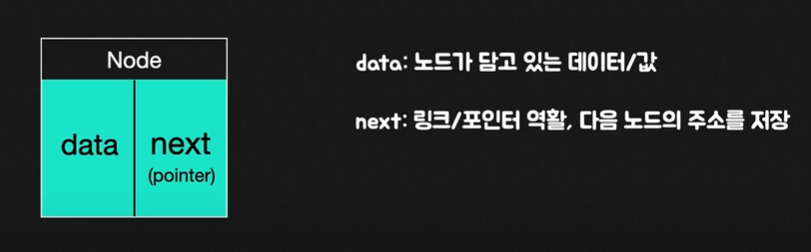
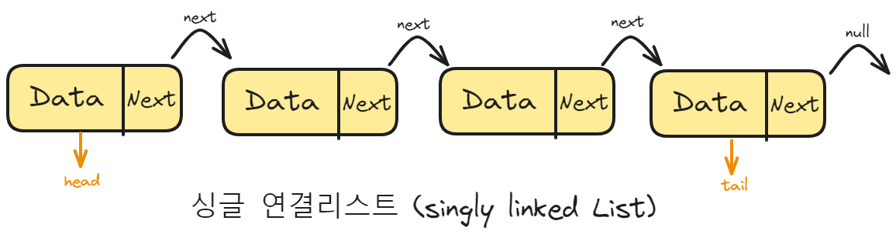
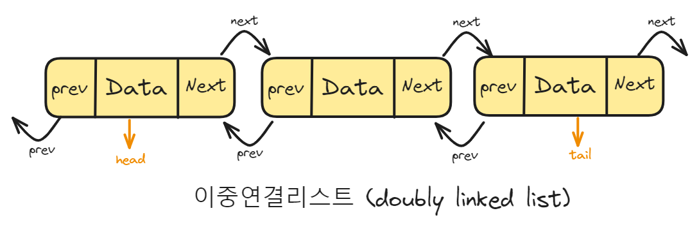
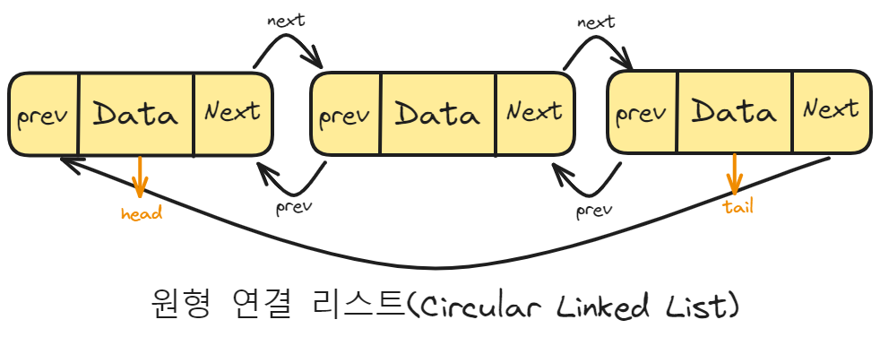
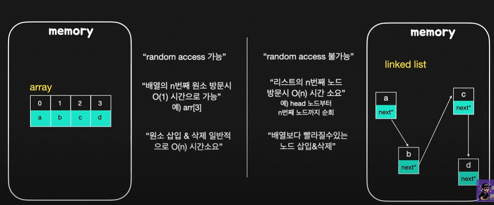
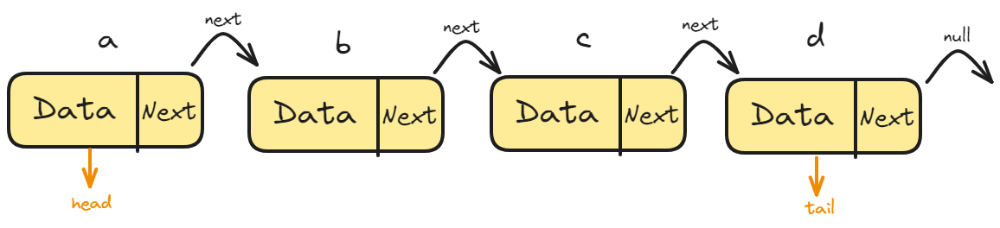

# 연결리스트

연결리스트는 데이터를 감싼 노드를 포인터로 연결해서 공간적인 효율성을 극대화시킨 자료구조이다.
연결리스트의 정의는 연속된 노드(Node)의 연결체인데 여기서 Node란 연결리스트에서 사용되는 하나의 데이터 덩어리이며, `데이터` & `링크`이 2가지의 필드를 담고있는 구조이다.


Node는 두가지 필드가 있는데 `Data`와 `Next(pointer)`가 있다.

- `Data`필드에는 노드가 가지고 있는 데이터값이 저장된다.
- `Next`필드에는 현재 노드가 참조하는,즉 다음 노드의 주소정보를 저장한다.
- 양방향 연결리스트의 경우 `prev`포인터(이전 노드의 주소)도 추가되서 활용된다.

## 연결리스트의 구조

### 싱글연결리스트는 next pointer만 가진다.



### 이중연결리스트는 next pointer와 prev pointer를 가진다.



### 원형 이중연결리스트는 이중연결리스트와 같지만 마지막노드의 next pointer가 헤드 노드를 가리키는 것을 말한다.



## 배열과 연결리스트 비교



- 배열은 상자가 순서대로 나열한 데이터 구조이며 몇번째 상자인지만 알면 해당 상자의 요소를 끄집어 낼수 있다.
- 연결리스트는 상자를 선으로 연결한 형태의 데이터 구조이며, 상자안의 요소를 알기 위해서는 하나씩 상자 내부를 확인해봐야 한다는 점이 다르다.

탐색은 배열이 빠르고 연결리스트가 느리다.(배열은 O(1), 연결리스트는 O(n)) 하지만 데이터 추가 및 삭제는 연결리스트가 더 빠르고 배열이 느리다. 배열은 모든 것을 앞으로 옮겨야 추가가 가능하지만 연결리스트는 선을 바꿔서 연결해주기만 하면된다.

## 코드로 보는 연결리스트


그림과 같은 연결리스트를 노드로 구현해보자.

```ts
class Node {
  constructor(data) {
    this.data = data;
    this.next = null;   
  }
}

let head = new Node('a');
head.next = new Node('b');
head.next.next = new Node('c');
head.next.next.next = new Node('d');
```

## Reference

- 면접을 위한 CS전공지식 노트
- https://www.youtube.com/watch?v=K1PlysPgNZY
