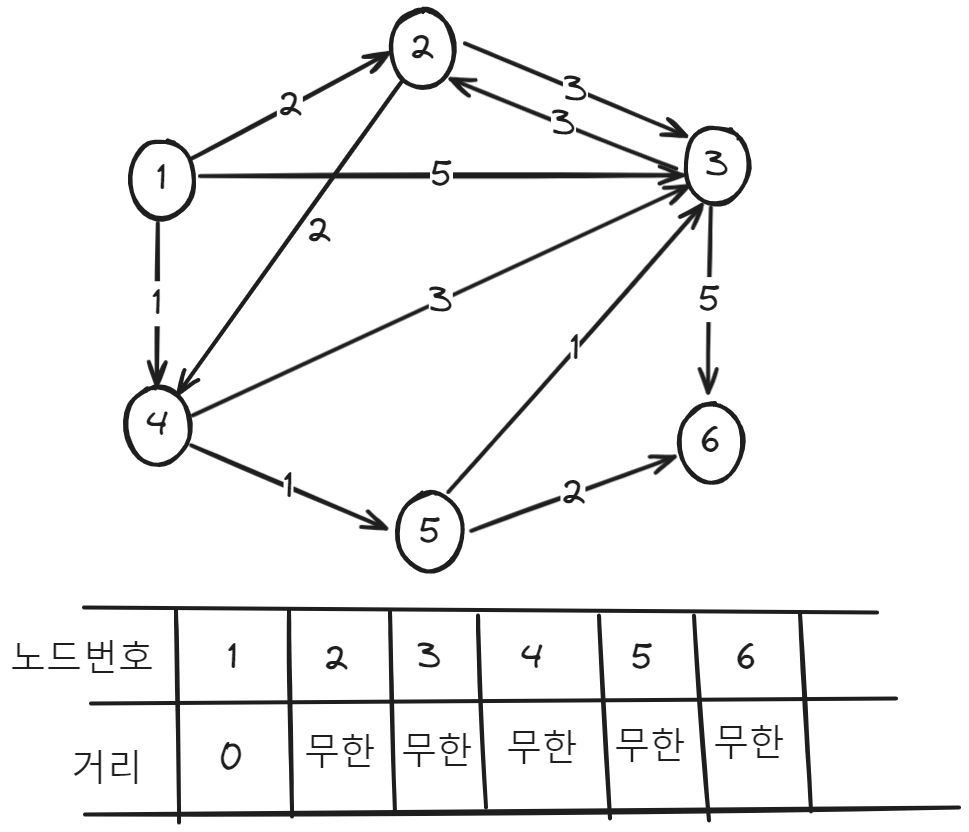
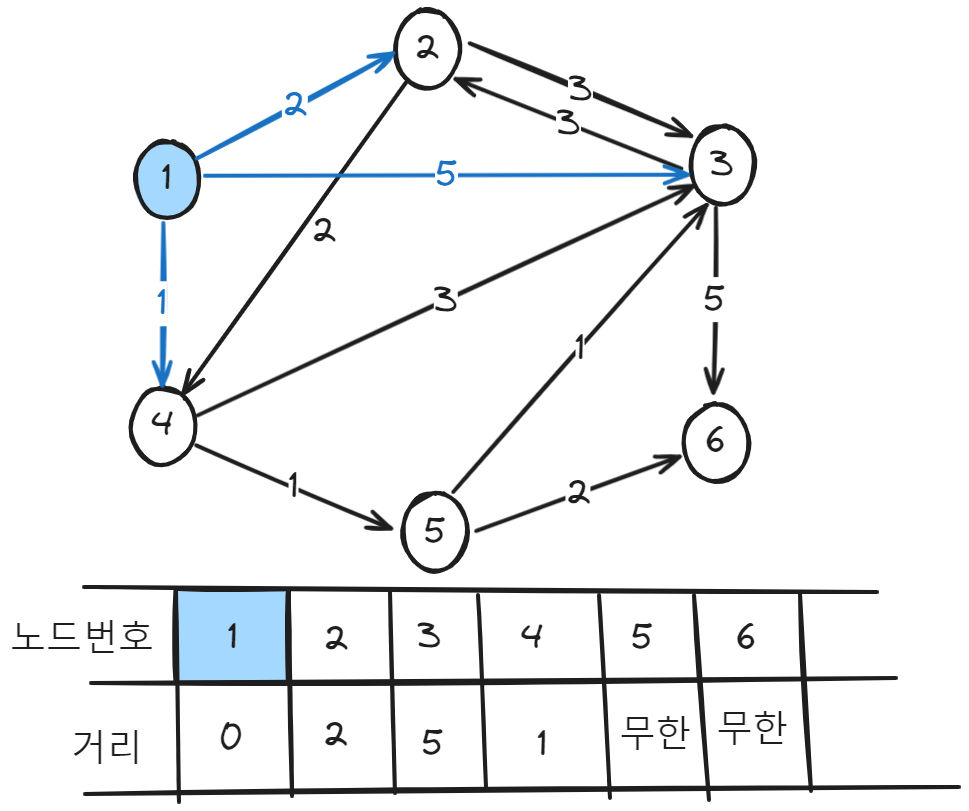
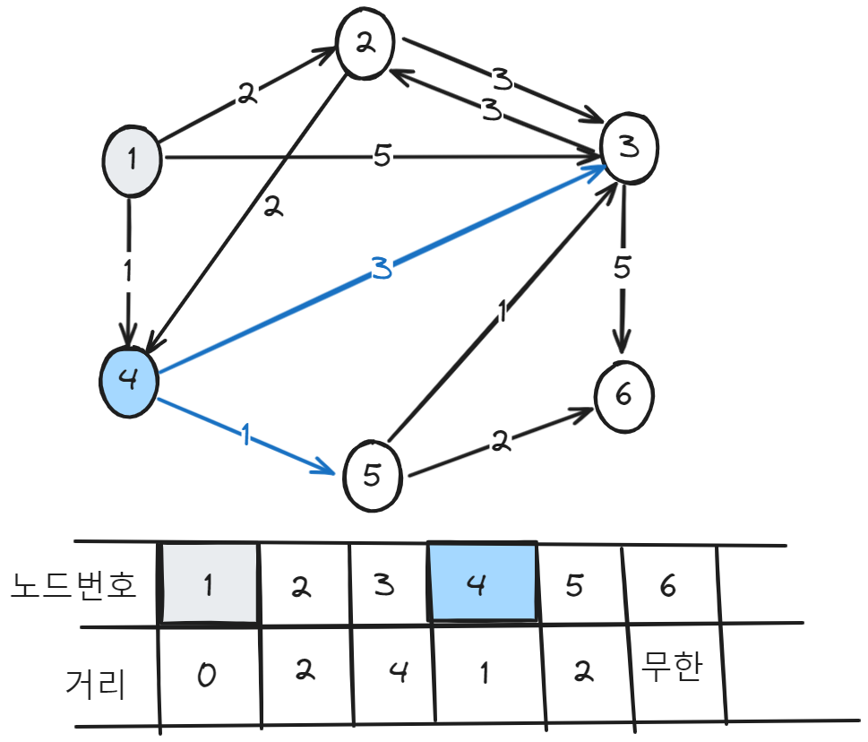
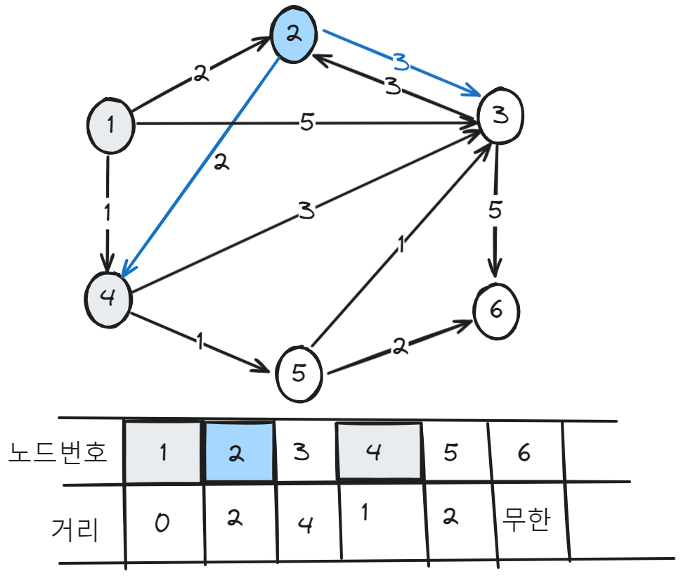
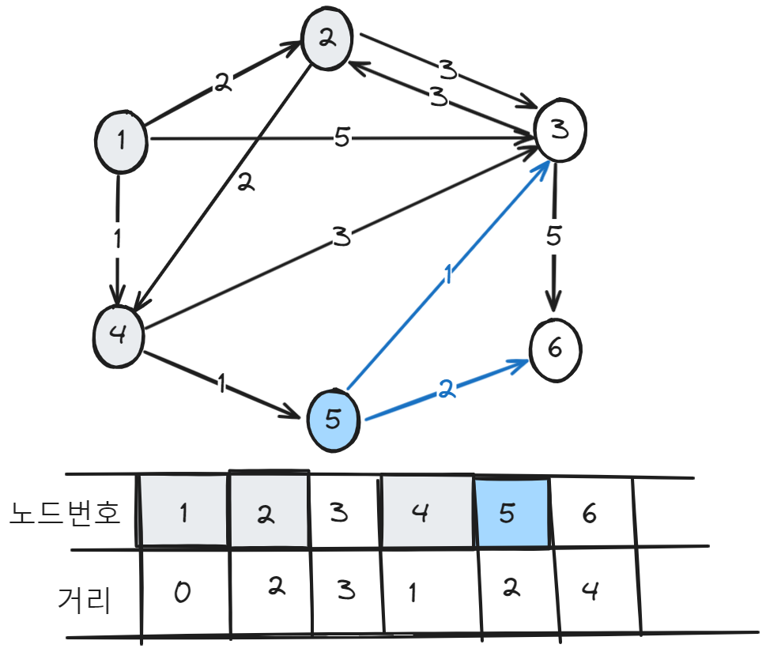
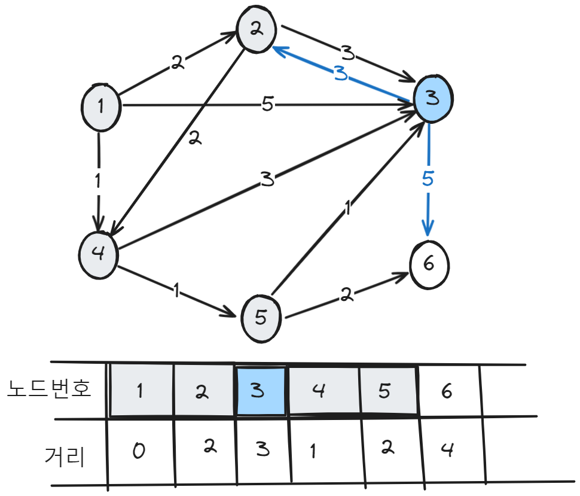
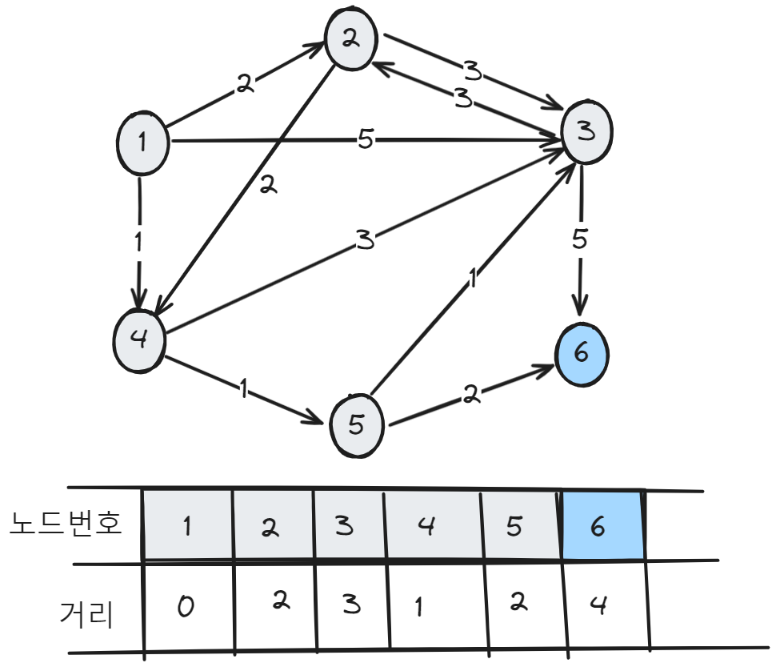

# 다익스트라 알고리즘

- 특정한 노드에서 출발하여 다른 노드로 가는 각각의 최단 경로를 구해주는 알고리즘
- 음의 간선이 없을 때 정상적으로 동작한다.

## 다익스트라 알고리즘 원리

1. 출발노드를 설정한다.
2. 최단거리 테이블을 초기화한다.(자기자신은 0, 모든경로의 거리는 무한)
3. 방문하지 않은 노드중에서 최단 거리가 가장 짧은 노드를 선택한다.
4. 해당노드를 거쳐 다른노드로 가는 비용을 계산하여 최다너기 테이블을 갱신한다.
5. 3.번과 4번을 반복한다.

