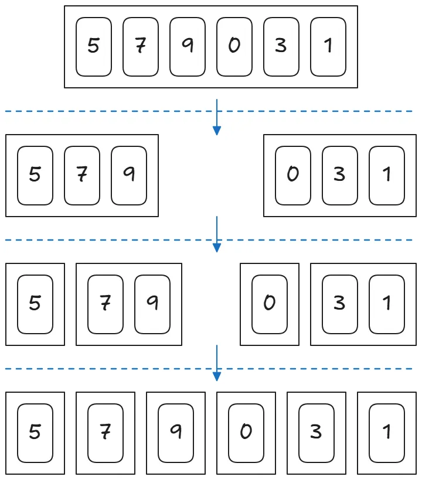
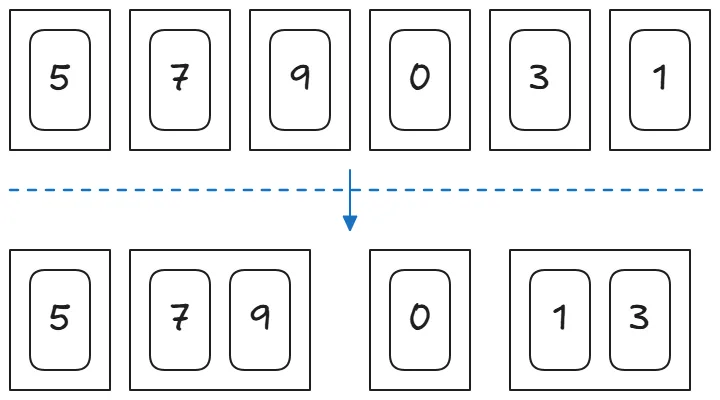
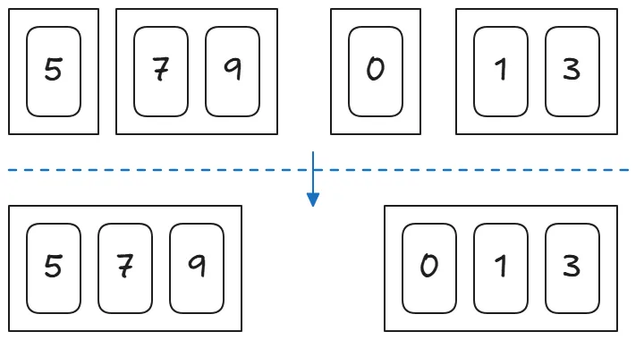
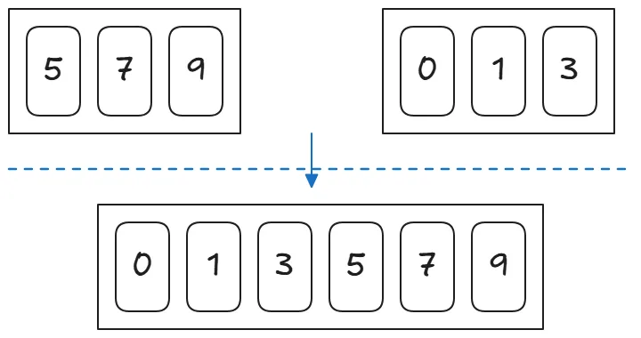

### 병합 정렬

병합정렬은**"분할 → 정복 → 병합"** 과정을 반복하여 정렬하는 알고리즘입니다.

**1단계:분할**

주어진 배열을 계속해서 반으로나눕니다.


**2단계: 병합하여 정렬하기**

첫 번째 병합 (작은 그룹끼리 정렬 후 합치기)

- [7] + [9] → [7, 9]
- [3] + [1] → [1, 3]



두 번째 병합 (더 큰 그룹끼리 정렬 후 합치기)

- [5] + [7, 9] → [5, 7, 9]
- [0] + [1, 3] → [0, 1, 3]
  

세 번째 병합 (최종 정렬 및 병합)

- [5, 7, 9] + [0, 1, 3]을 병합
  

**병합 절렬 시간복잡도**

- 최선, 평균, 최악 모두 O(nlogn)입니다.
- 분할할 때 걸리는 시간은 O(n), 병합에 걸리는 시간은 O(n), 그리고 레벨의 수가 O(logn)이므로 전체 레벨의 병합에 걸리는 총시간은 O(nlogn)입니다.

```ts
function merge(leftArr, rightArr) {
  const sortedArr = [];
  let l = 0;
  let r = 0;

  while (l < leftArr.length && r < rightArr.length) {
    if (leftArr[l] <= rightArr[r]) {
      sortedArr.push(leftArr[l]);
      l++;
    } else {
      sortedArr.push(rightArr[r]);
      r++;
    }
  }

  while (l < leftArr.length) {
    sortedArr.push(leftArr[l]);
    l++;
  }

  while (r < rightArr.length) {
    sortedArr.push(rightArr[r]);
    r++;
  }

  return sortedArr;
}

function mergeSort(arr) {
  if (arr.length === 1) {
    return arr;
  }

  const mid = Math.ceil(arr.length / 2);

  const leftArr = arr.slice(0, mid);
  const rightArr = arr.slice(mid);

  return merge(mergeSort(leftArr), mergeSort(rightArr));
}
```

```ts
function mergeSort(arr) {
  if (arr.length <= 1) return arr; // 재귀 종료 조건

  const mid = Math.floor(arr.length / 2);
  const left = mergeSort(arr.slice(0, mid));
  const right = mergeSort(arr.slice(mid));

  return merge(left, right);
}

function merge(left, right) {
  let result = [],
    i = 0,
    j = 0;

  while (i < left.length && j < right.length) {
    if (left[i] < right[j]) {
      result.push(left[i]);
      i++;
    } else {
      result.push(right[j]);
      j++;
    }
  }

  return [...result, ...left.slice(i), ...right.slice(j)];
}

console.log(mergeSort([5, 3, 8, 4, 2, 7, 1, 6]));
```
