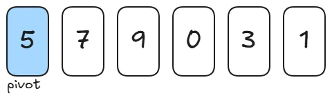

### 퀵 정렬

퀵정렬은 기준을 설정한 다음 큰 수와 작은 수를 교환한 후 리스트를 반으로 나누는 방식으로 동작합니다. 퀵정렬에서는 피벗.(pivot,축)이 사용됩니다.다. 큰 숫자와 작은숫자를 교환할 때, 교환하기 위한 “기준”을 피벗이라고 합니다.

**퀵정렬의 과정**

주어진 배열[5,7,9,0,3,1]이 있습니다.

**1단계: 피벗선택**

여기서 피벗은 5이고 이 피벗을 기준으로 작은값은 왼쪽으로, 큰값은 오른쪽으로 분할합니다.
2단계: 분할

왼쪽에는 피벗보다 작거나 같은 값,오른쪽에는 피벗 보다 큰값을 배치합니다.

**3단계: 왼쪽 파티션(0,3,1,5) 정렬**


**4단계: 오른쪽 파티션(7,9) 정렬**

**5단계: 최종 정렬된 배열**


**퀵정렬의 시간 복잡도**

- 최악의 경우(정렬이 되어 있는 경우) **O(n^2)** 입니다.
- 퀵정렬의 평균 시간 복잡도는 **O(NlogN)**입니다.

```ts
function quickSort(arr, left, right) {
  if (left >= right) {
    return;
  }

  /* 개선 방법
  const mid = (left + right) / 2;
  [arr[left], arr[mid]] = [arr[mid], arr[left]];
  */

  let pivot = arr[left];
  let x = left;
  let y = right;

  while (x < y) {
    while (pivot < arr[y]) {
      y--;
    }
    while (x < y && pivot >= arr[x]) {
      x++;
    }
    [arr[x], arr[y]] = [arr[y], arr[x]];
  }

  arr[left] = arr[x];
  arr[x] = pivot;

  quickSort(arr, left, x - 1);
  quickSort(arr, x + 1, right);

  return arr;
}
```

```ts
function quickSort(arr) {
  if (arr.length <= 1) return arr; // 재귀 종료 조건

  const pivot = arr[Math.floor(arr.length / 2)]; // 중간값을 피벗으로 선택
  const left = arr.filter((el) => el < pivot);
  const middle = arr.filter((el) => el === pivot);
  const right = arr.filter((el) => el > pivot);

  return [...quickSort(left), ...middle, ...quickSort(right)];
}

console.log(quickSort([5, 3, 8, 4, 2, 7, 1, 6]));
```
